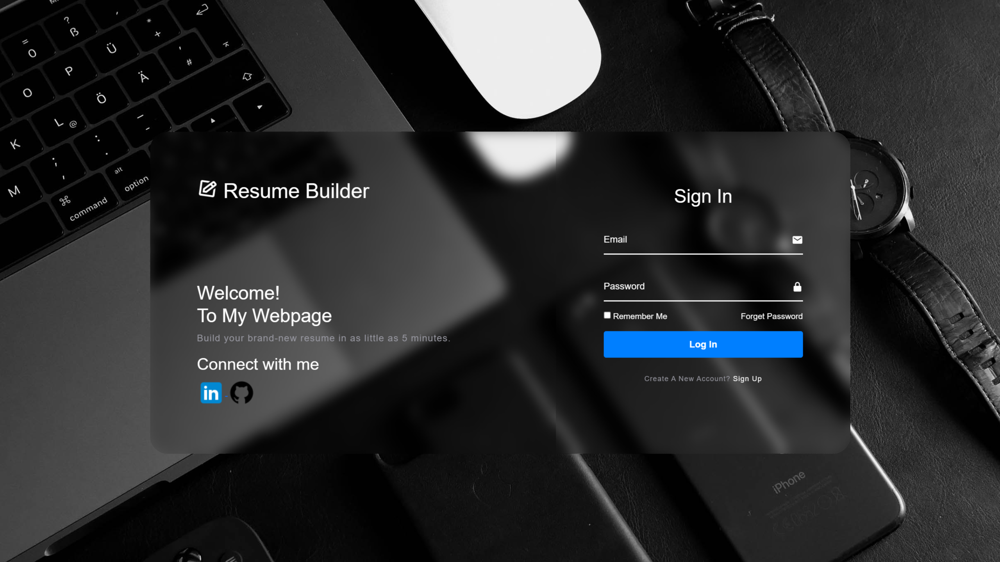
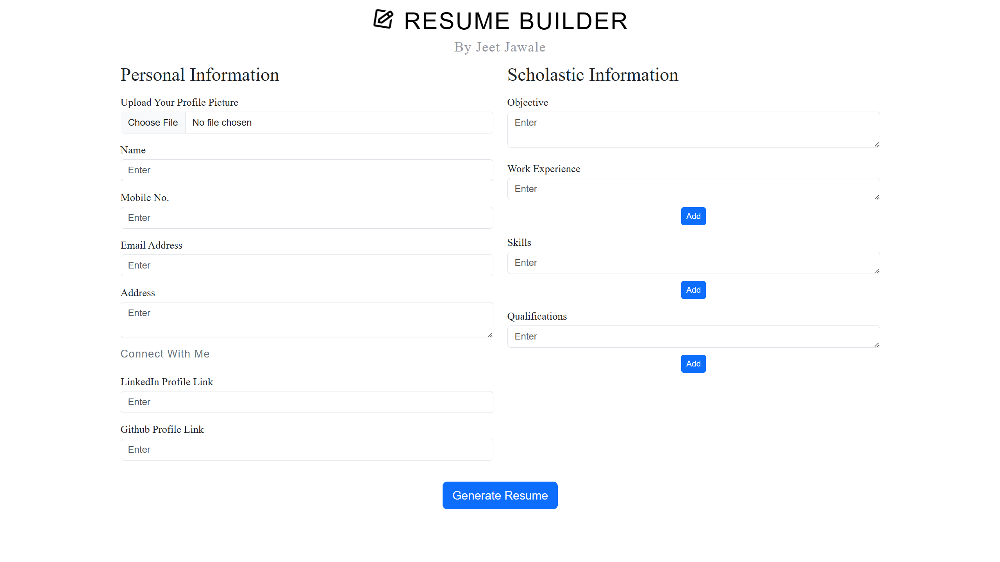
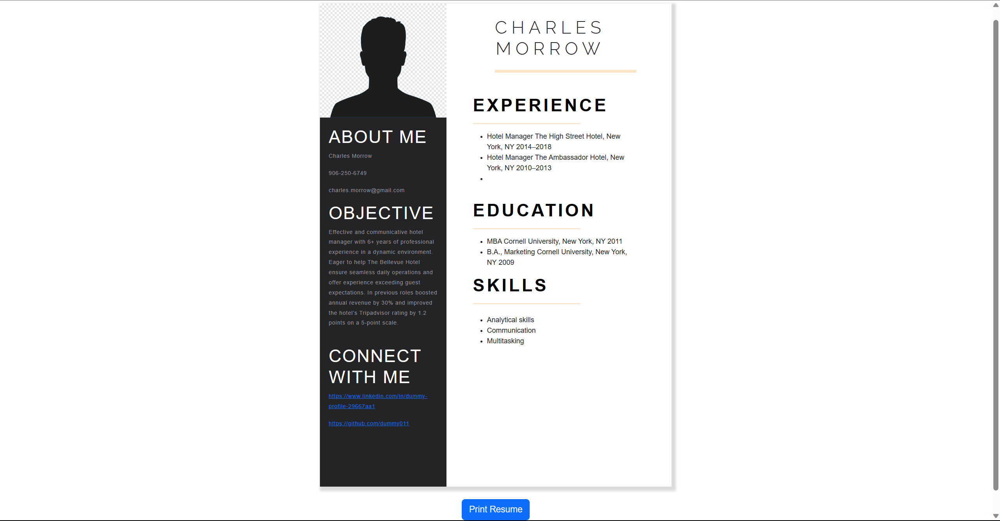

# Resume Builder
A web-based resume builder application that allows users to create professional resumes with ease.

## Features

- User registration and authentication: Sign up and log in securely to access the resume builder.
- Resume creation: Build personalized resumes with customizable sections such as personal information, education, experience, skills, objective, etc.
- Pre-designed template.
- Export options: Download the resume as a PDF.
- Currently the web application is optimized for laptop and PC screen sizes.

## Technologies Used

- Front-end: HTML5, CSS, JavaScript
- Content Delivery Networks: jsDelivr, font-awesome
- Front-end Framework: Bootstrap
- Authentication: JavaScript Authentication
- Database: Local Storage
- PDF Generation: jsPDF
- Hosting: GitHub Pages

## Screenshots

   
 
 
 
 
 
 

## License
- Resume Builder is packaged and distributed using the [MIT License](https://choosealicense.com/licenses/mit/) which allows for commercial use, distribution, modification and private use provided that all copies of the web page contain the same license and copyright.
